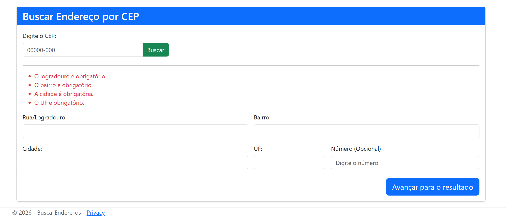
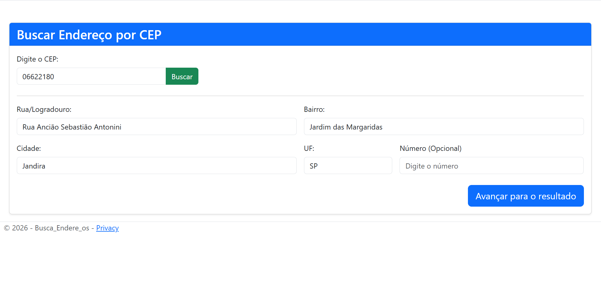
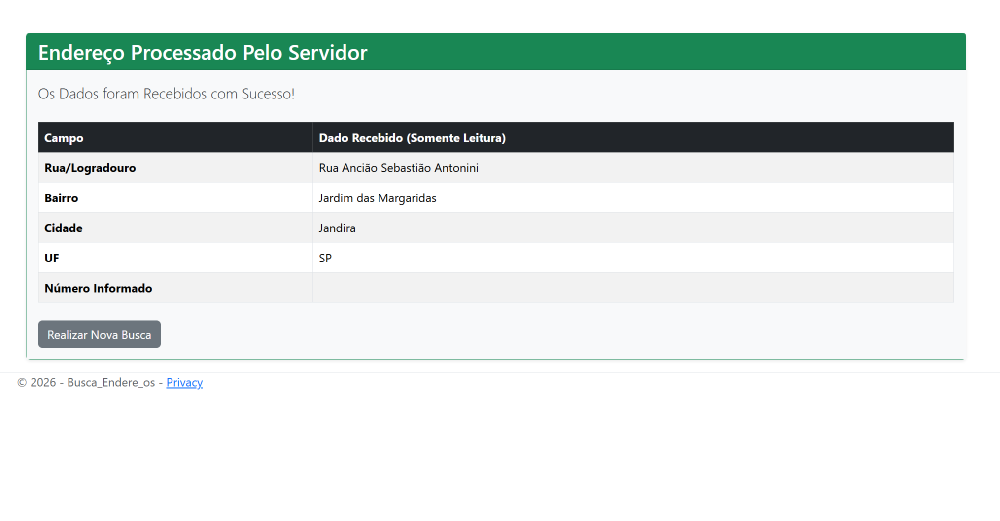

- 📍 Busca CEP API - AspNet Core MVC

Um sistema completo desenvolvido em C# com (ASP.NET) (Core MVC) que realiza a busca de endereços em tempo real sendo executado pela API (ViaCEP), integrando tecnologias no Front-End (jQuery/AJAX) e Back-End (Model Binding e Validation). Junto de uma interface responsiva e que irá salvar os dados encontrados em uma nova aba com as informações listadas em formato semelhante ao de uma tabela. Caso os dados não sejam corretamente preenchidos ou falte alguma informação dentro delas, a aplicação foi configurada para que não envie dados para sua outra janela e apontando os erros, assim trazendo segurança para seus dados e burlando qualquer tentativa de manipulação de informações. O preenchimento do "número" ficou como opcional já que a própria API não consegue trazer esse tipo de informação automaticamente dentro de sua plataforma.

- 🛠️ Tecnologias Utilizadas dentro da Aplicação do Projeto

Back-End: .NET 8 / C# (ASP.NET Core MVC)
Front-End: HTML5, CSS3, Bootstrap 5, FontAwesome
Scripts & Integração: jQuery, AJAX, API ViaCEP

- 📐 Arquitetura do Projeto (Padrão MVC)

O projeto cumpre o padrão de arquitetura **Model-View-Controller**:

* Model (`EnderecoViewModel.cs`): Define a estrutura dos dados do endereço e as regras de validação (`[Required]` e propriedades anuláveis `?`).
* View (`Buscar.cshtml` e `Resultado.cshtml`): Telas de interação com o usuário, utilizando Razor Pages e injeção de scripts para consumo da API.
* Controller (`HomeController.cs`): Gerencia as requisições HTTP (`GET` e `POST`), valida o estado do modelo e direciona o fluxo das páginas.

- 📸 Prints da Interface e suas funcionalidades

 
